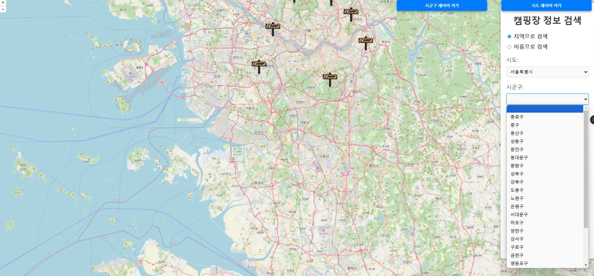

## WAVUS 2025 신입사원 교육 (GIS 프로그래밍 - 실습 파트)

- 교육자: 기술연구소 서동우

## 참고 사이트

- openlayer example ⇒ https://openlayers.org/en/latest/examples/
- postGIS ⇒ https://postgis.net/docs/manual-3.5/PostGIS_Special_Functions_Index.html#PostGIS_Aggregate_Functions
- 공공 데이터 포털 ⇒ https://www.data.go.kr/index.do

## GIS 교육 시스템 아키텍처

# 1. 학습 목표
💡 QGIS, Postgresql, PostGIS, OpenLayers, GeoServer 활용 방법
💡 간략적인 Spring 교육
💡 캠핑 정보 안내 사이트 완성

# 2. 완성할 화면

